<p align="center">
  
</p>

<h1 align="center">9Router TUI — Terminal Dashboard (Standalone)</h1>

<p align="center">
  <a href="README_ID.md">Indonesia</a> • <b>English</b>
</p>

<p align="center">
  
  
  
</p>

Standalone Terminal UI for **9Router** (`9router-master` v0.5.55) — **fully independent, no `omnexsync` or other external dependencies**. Only needs `NINEROUTER_URL` + `NINEROUTER_KEY` to connect to a running 9Router instance.

Mirrors the official web dashboard (`http://localhost:20128/dashboard`) in the terminal: health, providers, nodes, combos, models, keys, usage, settings — all via the same REST API `src/app/api/*`. This project is a separate, self-contained TUI — it does not import, bundle, or require `omnexsync`.

## Screenshots

<div align="center">

<table>
<tr>
<td align="center"><b>Overview</b><br>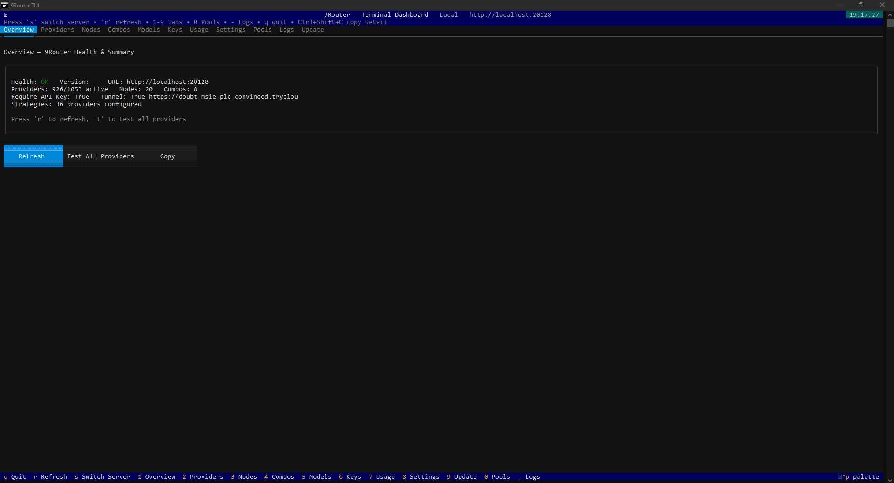</td>
<td align="center"><b>Providers</b><br>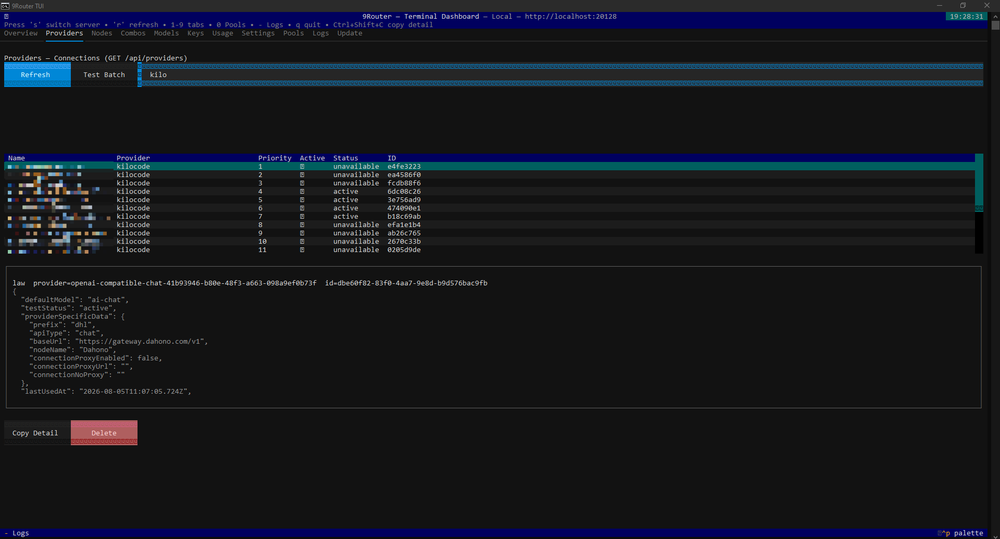</td>
<td align="center"><b>Nodes</b><br>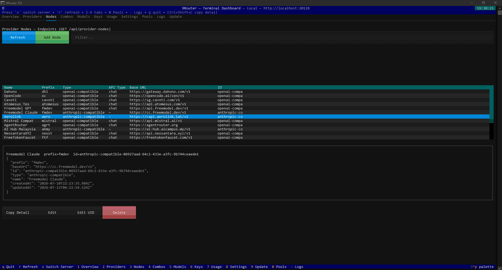</td>
</tr>
<tr>
<td align="center"><b>Nodes — Edit</b><br>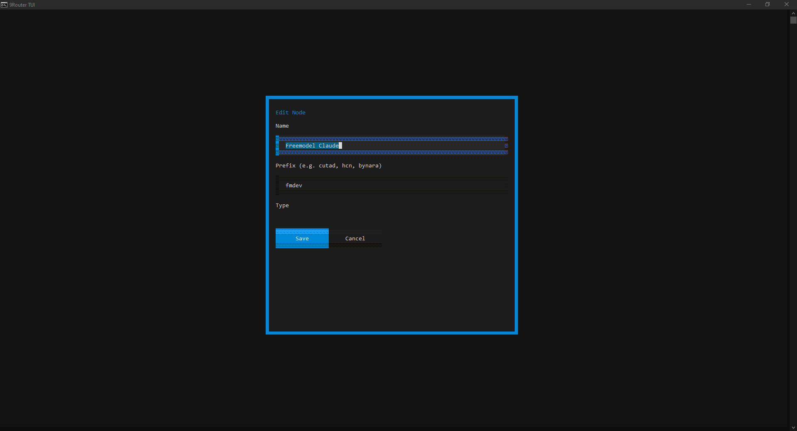</td>
<td align="center"><b>Nodes — Edit UID</b><br>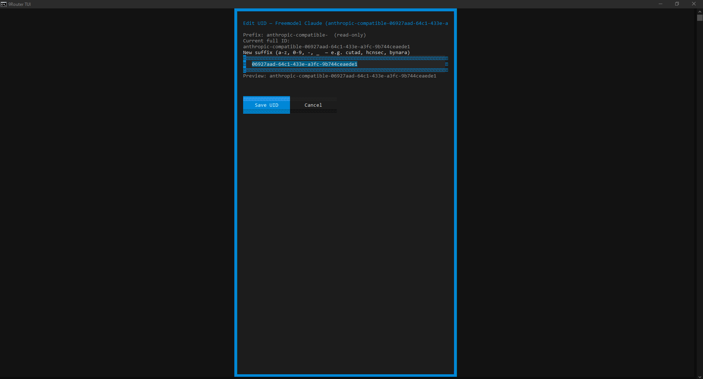</td>
<td align="center"><b>Combos</b><br>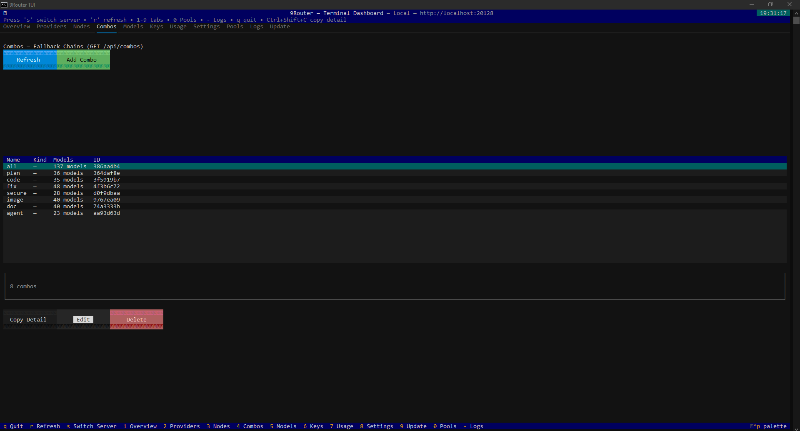</td>
</tr>
<tr>
<td align="center"><b>Models</b><br>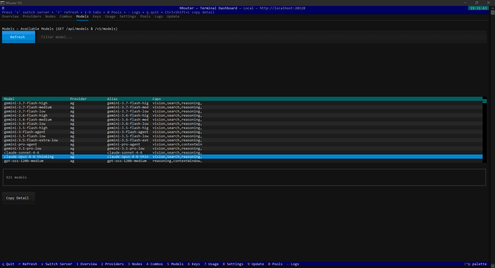</td>
<td align="center"><b>Keys</b><br>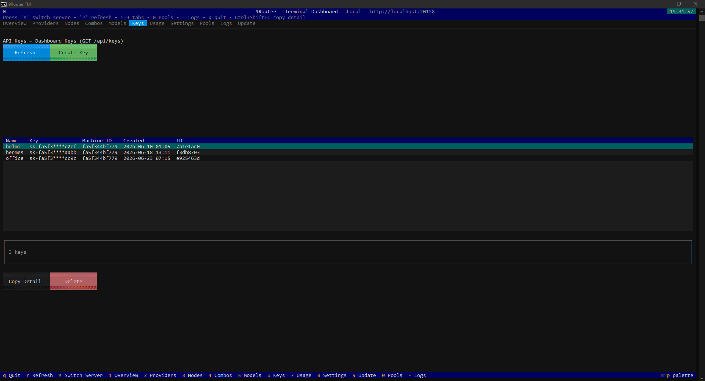</td>
<td align="center"><b>Usage</b><br>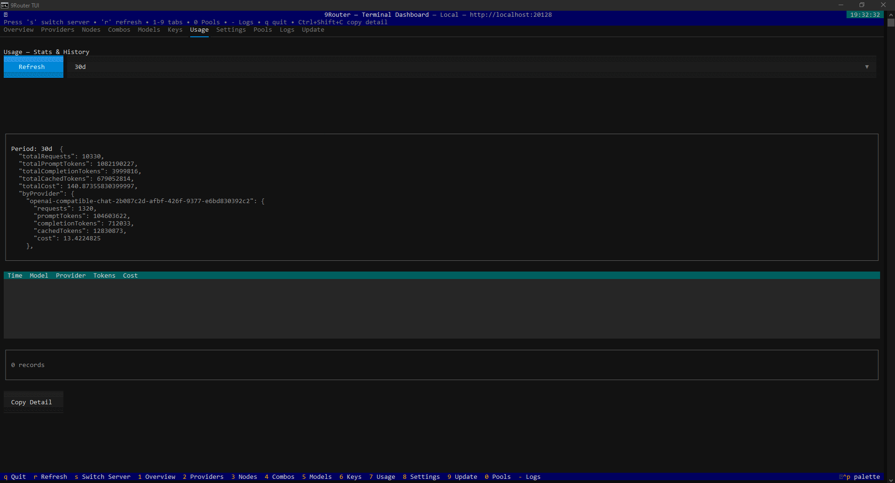</td>
</tr>
<tr>
<td align="center"><b>Usage — Days</b><br>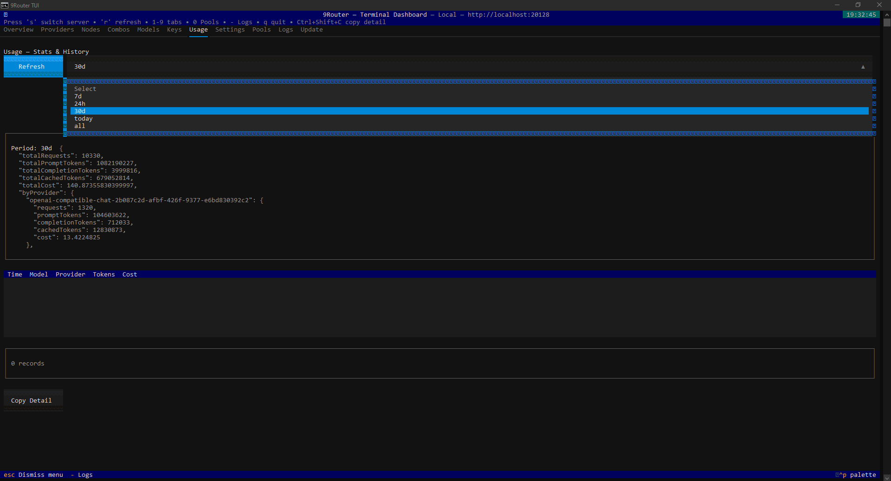</td>
<td align="center"><b>Updater</b><br>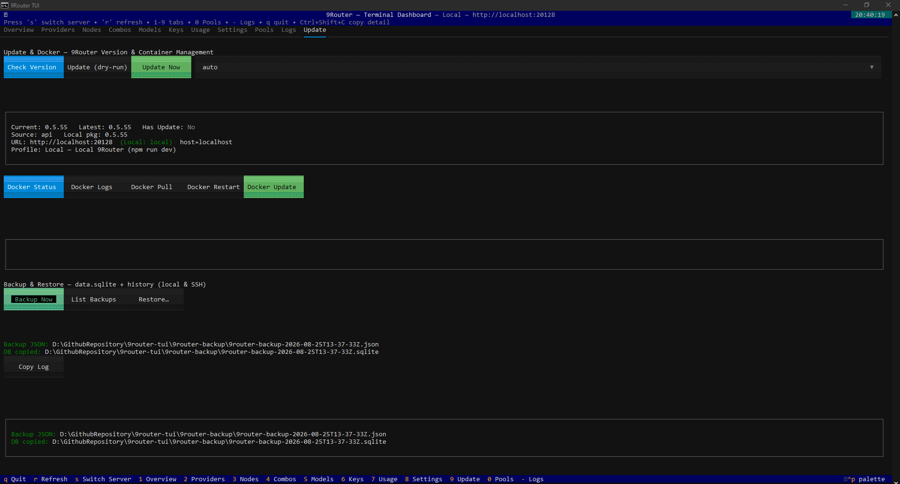</td>
<td align="center"><b>More…</b><br><em>11 tabs + modals</em></td>
</tr>
</table>

</div>

## Features

| Page | API | Description |
|---|---|---|
| **Overview** | `GET /api/health`, `GET /api/settings`, `GET /api/version`, `GET /api/provider-nodes`, `GET /api/providers`, `GET /api/combos` | Health, version, providers/nodes/combos summary, test all |
| **Providers** | `GET /api/providers`, `POST /api/providers/test-batch`, `PUT/DELETE /api/providers/:id` | Connections table, filter, detail, test batch, test selected, toggle active, delete |
| **Nodes** | `GET /api/provider-nodes`, `POST/PUT/DELETE /api/provider-nodes` | Nodes table, filter, detail, Add/Edit/Delete, **Edit UID** (combined in Edit, custom suffix like `cutad`, `hcnsec`) |
| **Combos** | `GET /api/combos`, `POST/PUT/DELETE /api/combos` | Combos table, detail, Add/Edit/Delete, model selector with filter |
| **Models** | `GET /api/models`, `GET /v1/models` | Models table, filter |
| **Keys** | `GET /api/keys`, `POST/PUT/DELETE /api/keys` | Dashboard keys table, Create/Edit/Delete, toggle active, masked |
| **Usage** | `GET /api/usage/stats`, `GET /api/usage/history` | Stats per period, history table |
| **Settings** | `GET /api/settings`, `PATCH /api/settings` | View + multi-config editor (form + Raw JSON), **TUI Config** (auto_login, theme, etc.), **Manage Servers** (add/edit/delete/reorder) |
| **Pools** | `GET /api/proxy-pools` | Proxy pools table, detail |
| **Logs** | `GET /api/usage/logs` | Request logs table, detail |
| **Update** | `GET /api/version` + npm registry, `updater.py` | Version check, update (npm/source/docker — local & remote via SSH), Docker status/logs/pull/restart, **Backup/Restore** (`data.sqlite` + history) |

## Quick Start

```bash
cd 9router-tui
pip install -r requirements.txt

# No config? Just run — TUI shows an interactive server picker
python app.py
# → Pick: Local (http://localhost:20128) / Tunnel / Custom URL + API key
# → Connect / Save & Connect (saved to servers.json)

# Or set env first
export NINEROUTER_URL="http://localhost:20128"
export NINEROUTER_KEY="sk-..."  # only if requireApiKey=true
python app.py

# CLI (Rich, non-interactive)
python cli.py health
python cli.py providers --filter hcn
python cli.py nodes
python cli.py combos
python cli.py models --filter gpt
python cli.py keys
python cli.py usage --period 7d
python cli.py settings
python cli.py test --mode all
python cli.py v1-models

# Manage multi-server (no config file needed)
python cli.py servers                    # list saved servers
python cli.py servers --probe            # + health probe

# Update & Docker (local only — remote shows info only)
python cli.py version                    # GET /api/version + npm latest
python cli.py version --json
python cli.py update --dry-run           # show plan (npm/source/docker auto-detect)
python cli.py update --method docker --dry-run
python cli.py update --yes               # execute (y/N confirmation without --yes)
python cli.py docker status              # docker ps + images + compose
python cli.py docker logs --tail 100
python cli.py docker pull --image decolua/9router:latest
python cli.py docker restart --container 9router
python cli.py docker update --dry-run    # compose pull + up -d
python cli.py server-add https://my-9router.example.com --name "My VPS" --api-key sk-...
python cli.py server-use                 # interactive picker
python cli.py server-use "My VPS"        # use directly
python cli.py server-remove "My VPS"

# Custom URL/key per-command
python cli.py --url https://distribute-jimmy-church-audit.trycloudflare.com --api-key sk-... providers
python app.py --url http://localhost:20128 --api-key sk-...
```

## Download (Release)

Pre-built binaries — no Python needed:

| Platform | File | How to Run |
|---|---|---|
| **Windows** | `9Router-TUI-1.2.0-windows-x86_64.exe` | Double-click |
| **Linux** | `9Router-TUI-1.2.0-x86_64.AppImage` | `chmod +x *.AppImage && ./9Router-TUI-*.AppImage` |

Get them from **GitHub Releases** (tag `v1.2.0`). Also available as `9Router-TUI.exe` / `9Router-TUI` without version suffix.

```bash
# Linux AppImage
chmod +x 9Router-TUI-1.2.0-x86_64.AppImage
./9Router-TUI-1.2.0-x86_64.AppImage --help
./9Router-TUI-1.2.0-x86_64.AppImage --version

# Windows
9Router-TUI-1.2.0-windows-x86_64.exe --version
```

> Version is defined in `VERSION` (single source of truth). `app.py --version` and `cli.py --version` read from it. Bump `VERSION` and tag `v1.2.1` to trigger a new release.

## Double-Click — Run Without PowerShell / Terminal

No need to open PowerShell or type `python app.py` — just **double-click**.

### Option 1: Standalone `.exe` / `.AppImage` (Recommended) ✅

Pre-built via PyInstaller — **no Python required**.

| Platform | Build | Output |
|---|---|---|
| Windows | `python -m PyInstaller 9Router-TUI.spec --noconfirm` | `dist/9Router-TUI.exe` |
| Linux | `bash build-appimage.sh` | `dist/9Router-TUI-1.2.0-x86_64.AppImage` |

- `console=True` in `9Router-TUI.spec` so double-click automatically opens a console window for the TUI.
- `icon='icon.ico'` — built from `icons/9tui-icon.png` (512x512) with multi-size ICO.
- Verified: `dist\9Router-TUI.exe --version` → `1.2.0`.
- The spec at `9Router-TUI.spec` handles `textual` + `rich` via `collect_all` and bundles `VERSION` + `_version.py`.
- `build/` and `dist/` are in `.gitignore` (only `9Router-TUI.spec` is tracked).

**Desktop Shortcut (Windows):** right-click `dist\9Router-TUI.exe` → `Send to` → `Desktop (create shortcut)` → rename to "9Router TUI".

**Linux Desktop Entry:** `9Router-TUI.desktop` is included — copy to `~/.local/share/applications/` and make the AppImage executable.

**Icon:** `icon.ico` / `icon.png` (512x512) generated from `icons/9tui-icon.png` — already set as `icon='icon.ico'` in `9Router-TUI.spec`. `build-appimage.sh` picks up `icon.png` automatically.

**Reduce Size:** `upx=True` is already enabled. Alternatives: build with `--onedir` then zip, or exclude `numpy`/`PIL` if unused. For a Start Menu installer, wrap the `.exe` with Inno Setup.

### Option 2: `9Router-TUI.bat` / `9Router-TUI.cmd` (requires Python, Windows)

Double-click `9Router-TUI.bat` — auto-runs `pip install -r requirements.txt` if `textual` is missing, then `python app.py`. If `.ps1` opens in Notepad (broken `ftype`), double-click `9Router-TUI.cmd` instead (bypasses the association).

### Option 3: `9Router-TUI.pyw` (requires Python, Windows)

`.pyw` is associated with `pythonw` — double-click spawns a new console via `CREATE_NEW_CONSOLE` and runs `app.py`. Fallback if `.bat` is blocked.

### Option 4: `9Router-TUI.ps1` (requires Python, Windows)

`powershell -ExecutionPolicy Bypass -File 9Router-TUI.ps1` — auto-installs deps. If double-click opens Notepad, fix: `ftype Microsoft.PowerShellScript.1="C:\Windows\System32\WindowsPowerShell\v1.0\powershell.exe" "%1" %*` (admin).

| File | Requires Python? | How to Use |
|---|---|---|
| `dist/9Router-TUI.exe` | No | Double-click directly (Windows) |
| `dist/*.AppImage` | No | `chmod +x` + double-click / `./*.AppImage` (Linux) |
| `9Router-TUI.bat` | Yes | Double-click (Windows) |
| `9Router-TUI.cmd` | Yes | Double-click — fixes `.ps1` Notepad issue |
| `9Router-TUI.pyw` | Yes | Double-click (`.pyw` associated with Python Launcher) |
| `9Router-TUI.ps1` | Yes | `powershell -ExecutionPolicy Bypass -File 9Router-TUI.ps1` |
| `9Router-TUI.spec` | For building | `pyinstaller 9Router-TUI.spec` |
| `build-appimage.sh` | For building | `bash build-appimage.sh` (Linux) |

## Configuration

**Precedence:** `CLI --url/--api-key` > `env NINEROUTER_URL/NINEROUTER_KEY` > `config.toml [server]` / `servers.json` / `config.toml [[servers]]` > default `http://localhost:20128`

**No config:** `python app.py` shows a **Server Picker** — pick `Local` / `Tunnel` / `Custom` (enter URL + API key), then `Connect` or `Save & Connect` (saved to `servers.json`).

**Multi-server:** Save multiple 9Routers (Local, Tunnel, VPS) in `servers.json` or `config.toml [[servers]]` — switch anytime in the TUI with `s`.

```bash
# .env
NINEROUTER_URL=http://localhost:20128
NINEROUTER_KEY=sk-fa5f...
NINEROUTER_PASSWORD=  # if dashboard uses password

# config.toml
[server]
url = "http://localhost:20128"
api_key = ""
timeout = 15

# Multi-server (optional)
# [[servers]]
# name = "Local"
# url = "http://localhost:20128"
# api_key = ""
# description = "Local 9Router (npm run dev)"
#
# [[servers]]
# name = "Tunnel"
# url = "https://distribute-jimmy-church-audit.trycloudflare.com"
# api_key = "sk-..."
# description = "Cloudflare Tunnel"
#
# [[servers]]
# name = "VPS"
# url = "https://9router.example.com"
# api_key = "sk-..."
# description = "My VPS"

# servers.json (alternative, see servers.json.example)
# [
#   {"name":"Local","url":"http://localhost:20128","api_key":"","description":"Local"},
#   {"name":"VPS","url":"https://9router.example.com","api_key":"sk-...","description":"My VPS"}
# ]

[ui]
theme = "dark"
refresh_interval = 30
default_page = "dashboard"
```

See `config.toml.example`, `servers.json.example`, and `.env.example`.

## TUI Keybindings

| Key | Action |
|---|---|
| `q` | Quit |
| `r` | Refresh active page |
| `s` | **Switch Server** — open picker (Local / Tunnel / Custom) |
| `1` | Dashboard (Health / Profiles / TUI Config) |
| `2` | Endpoint & Key (Endpoints / Keys) |
| `3` | Providers (Connections / Available Models / Nodes / Models) |
| `4` | Combos |
| `5` | Usage (Stats / Request Logs) |
| `6` | System (Proxy Pools / Settings / Update & Docker) |
| `↑/↓` | Navigate table |
| `Enter` | View JSON detail for selected row / Connect in picker |
| `Tab` | Switch tab |
| `Ctrl+C` | Copy detail (or Input selection) |
| `Ctrl+Shift+C` | Copy detail (force) |
| `Ctrl+A` | Select all in Input |

## 9Router Locations

| Location | URL |
|---|---|
| Localhost | `http://localhost:20128` (default, `npm run dev` in `9router-master/`) |
| Tunnel | `https://distribute-jimmy-church-audit.trycloudflare.com` (from backup `tunnelUrl`) |
| VPS | `https://9router.example.com` |
| Docker | `http://9router:20128` |

## API Reference (used by the TUI)

All via `client.py` — no direct SQLite writes.

| Method | Path | Description |
|---|---|---|
| `GET` | `/api/health` | `{ok:true}` |
| `GET` | `/api/providers` | List connections |
| `POST` | `/api/providers/test-batch` | Test batch |
| `GET` | `/api/provider-nodes` | List nodes |
| `GET` | `/api/combos` | List combos |
| `GET` | `/api/models` | Models + aliases |
| `GET` | `/v1/models` | OpenAI-compatible models |
| `GET` | `/api/keys` | Dashboard keys |
| `POST` | `/api/keys` | Create key |
| `DELETE` | `/api/keys/:id` | Delete key |
| `GET` | `/api/settings` | Settings |
| `PATCH` | `/api/settings` | Update settings (multi-config) |
| `GET` | `/api/provider-nodes` | List nodes |
| `POST` | `/api/provider-nodes` | Create node |
| `PUT` | `/api/provider-nodes/:id` | Update node |
| `DELETE` | `/api/provider-nodes/:id` | Delete node |
| `GET` | `/api/combos` | List combos |
| `POST` | `/api/combos` | Create combo |
| `PUT` | `/api/combos/:id` | Update combo |
| `DELETE` | `/api/combos/:id` | Delete combo |
| `GET` | `/api/proxy-pools` | Proxy pools |
| `GET` | `/api/usage/logs` | Request logs |
| `GET` | `/api/usage/stats?period=7d` | Usage stats |
| `GET` | `/api/usage/history?limit=50` | History |
| `GET` | `/api/version` | Version |

## Troubleshooting

| Error | Fix |
|---|---|
| `Cannot reach 9Router at http://localhost:20128` | Make sure 9Router is running: `cd 9router-master/9router-master && npm run dev` (PORT=20128) |
| `401 Unauthorized` | Set `NINEROUTER_KEY` (Dashboard → Keys → copy `sk-...`) if `requireApiKey=true` |
| `No module named 'textual'` | `pip install -r requirements.txt` |
| `No module named 'rich'` | `pip install rich` |
| Double-click `.exe` closes immediately | Run via `cmd` to see the error: `dist\9Router-TUI.exe` — usually a wrong port/config |
| `.pyw` does nothing | Ensure `.pyw` is associated with Python Launcher (`pyw`). Otherwise use `.bat` or `.exe` |

## Update & Docker (Local & Remote VPS)

- **Version:** `GET /api/version` (current + latest from npm `9router`, `hasUpdate`) + fallback to local `package.json` + `https://registry.npmjs.org/9router/latest`
- **Update:** auto-detects `npm` / `source` (git pull + npm install + build) / `docker` (compose pull + up -d or docker pull). **Local** executes directly, **remote VPS** via SSH (if `ssh_host` is set in `servers.json`).
- **Docker:** `docker ps` (containers), `docker images`, `docker logs --tail`, `docker pull`, `docker restart` / `compose restart`, `docker update` (pull + up -d) — all work **locally or remotely via SSH**.

**Remote VPS via SSH:** Add `ssh_host`/`ssh_user`/`ssh_key`/`compose_path` in `servers.json` or `config.toml [[servers]]` — then `update` & `docker` automatically run via `ssh user@host "docker ..."`.

```json
{
  "name": "VPS",
  "url": "https://9router.example.com",
  "api_key": "sk-...",
  "ssh_host": "1.2.3.4",
  "ssh_user": "root",
  "ssh_key": "~/.ssh/id_rsa",
  "compose_path": "/opt/9router/docker-compose.yml",
  "install_method": "docker"
}
```

```bash
# CLI — remote via SSH
python cli.py --server VPS version
python cli.py --server VPS update --dry-run
python cli.py --server VPS update --yes
python cli.py --server VPS docker status
python cli.py --server VPS docker logs --tail 100
python cli.py --server VPS docker restart
python cli.py --server VPS docker update --dry-run
```

TUI **Update** tab (key `9`): Check Version, Update (dry-run / now), Docker Status/Logs/Pull/Restart/Update — all via `updater.py`. If the active server is a VPS with `ssh_host`, all buttons automatically run via SSH (labeled `(remote)`).

## Docker

Alpine-based (`python:3.12-alpine`), image `helmiau/9router-tui` — repo `https://github.com/helmiau/9router-tui`.

```bash
# Build locally
docker build -t helmiau/9router-tui:latest .

# TUI (interactive)
docker run -it --rm \
  -e NINEROUTER_URL=http://host.docker.internal:20128 \
  -e NINEROUTER_KEY=sk-... \
  --add-host host.docker.internal:host-gateway \
  helmiau/9router-tui

# CLI
docker run --rm helmiau/9router-tui python cli.py health
docker run --rm helmiau/9router-tui python cli.py providers
docker run --rm -e NINEROUTER_URL=https://9router.example.com helmiau/9router-tui python cli.py version

# With servers.json & SSH (for VPS Docker via SSH)
docker run -it --rm \
  -v ./servers.json:/app/servers.json:ro \
  -v ~/.ssh:/home/appuser/.ssh:ro \
  helmiau/9router-tui

# Compose
docker compose run --rm 9router-tui
docker compose run --rm 9router-tui python cli.py health
```

**GHCR & Docker Hub:** The workflow at `.github/workflows/docker-publish.yml` builds multi-arch (`linux/amd64`, `linux/arm64`) and pushes to `docker.io/helmiau/9router-tui` & `ghcr.io/helmiau/9router-tui` on push to `main`/`master` or tag `v*`. Requires secrets `DOCKERHUB_USERNAME` + `DOCKERHUB_TOKEN` (Docker Hub) — GHCR uses `GITHUB_TOKEN` automatically.

## System Requirements

| Component | Minimum | Recommended |
|---|---|---|
| **OS** | Windows 10 / Ubuntu 20.04 / Debian 11 / macOS 12 | Windows 11 / Ubuntu 22.04+ / Debian 12+ |
| **CPU** | 1 vCPU (x64 or ARM64) | 2 vCPU+ |
| **RAM** | 256 MB free (TUI ~60–120 MB) | 512 MB+ free |
| **Disk** | 150 MB (exe ~40 MB + Python deps) | 500 MB (with backups) |
| **Python** | 3.10+ (for `python app.py` / `cli.py`) | 3.12+ |
| **Terminal** | Any with UTF-8 + 80×24 | Windows Terminal / WezTerm / kitty / Alacritty (for OSC 52 clipboard) |
| **Network** | HTTP to 9Router (`:20128`) | Low latency to 9Router host |
| **Docker** | Optional — for `helmiau/9router-tui` image | Docker 24+ with Buildx (for multi-arch) |

> **Standalone exe/AppImage:** No Python needed — just double-click. Same RAM/disk as above. AppImage needs `libfuse2` on older distros (`sudo apt install libfuse2`).

## Project Structure

```
9router-tui/
  app.py              # Shim — from tui.app import NineRouterTUI (keeps double-click & PyInstaller working)
  tui/                # Modular TUI package
    app.py            # NineRouterTUI (App, BINDINGS, clipboard)
    helpers.py        # mask_key, fmt_time, _store_plain, UID helpers
    backup.py         # Backup/restore helpers (data.sqlite + history, local & SSH)
    panes/            # 11 panes: overview, providers, nodes, combos, models, keys, usage, settings, pools, logs, update
    screens/          # Modals: picker, settings_edit, nodes, combos, keys, confirm, backup_restore
  cli.py              # Rich CLI (health, providers, nodes, combos, models, keys, usage, settings, test, dashboard, servers, version, update, docker)
  client.py           # NinerouterClient (all REST APIs) + ServerProfile / probe
  updater.py          # Version check, update (npm/source/docker), docker status/logs/pull/restart
  icons/              # App icons (9tui-icon.png → icon.ico/icon.png for exe/AppImage)
  9Router-TUI.spec    # PyInstaller spec — builds double-click .exe (dist/9Router-TUI.exe)
  9Router-TUI.bat     # Double-click launcher (requires Python) — auto pip install + python app.py
  9Router-TUI.pyw     # Double-click launcher .pyw (requires Python) — spawns new console
  Dockerfile          # Alpine (python:3.12-alpine) → helmiau/9router-tui
  docker-compose.yml  # TUI + CLI via compose
  .github/workflows/docker-publish.yml  # Build & push multi-arch
  requirements.txt
  config.toml.example
  servers.json.example
  .env.example
  README.md           # English (default)
  README_ID.md        # Indonesia
```

## License

Standalone and independent — no dependency on `omnexsync` or any other external project. Follows the `9router-master` license (MIT).
